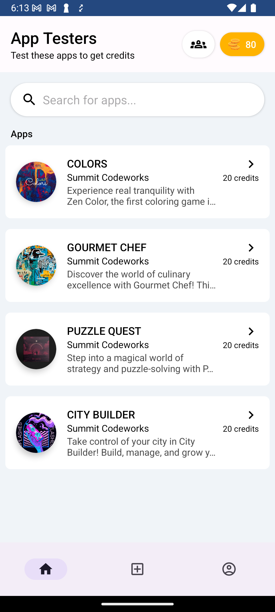
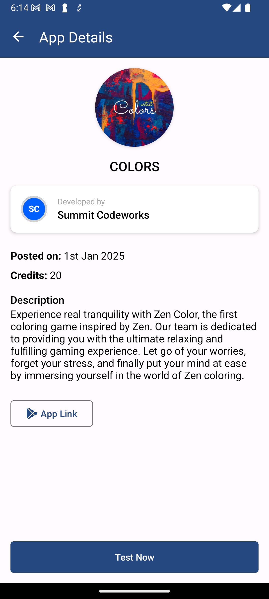
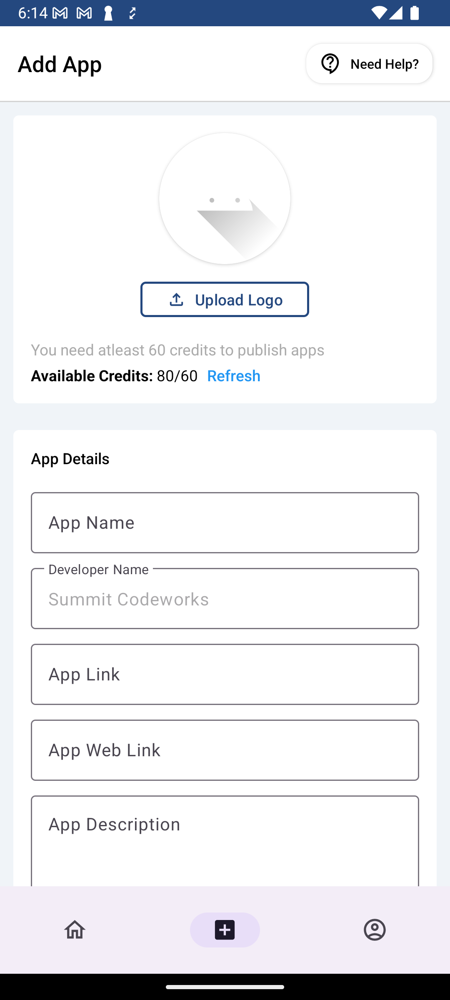
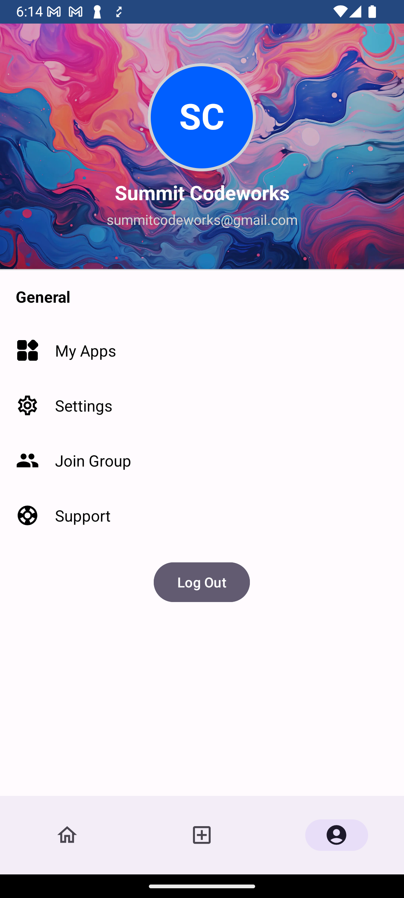
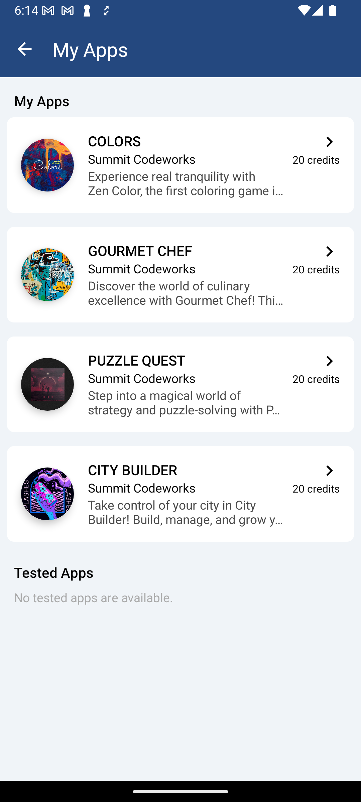
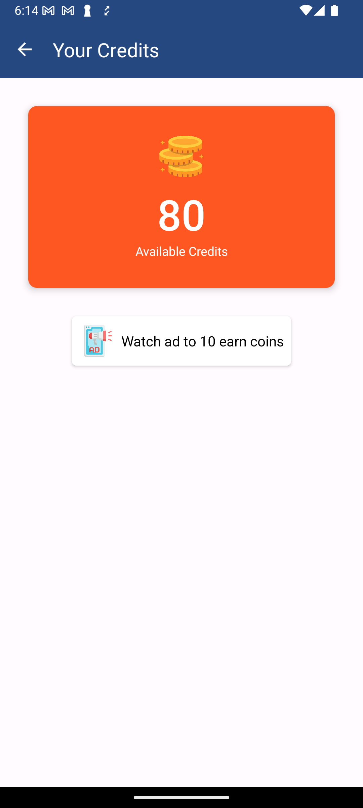

# App Testers

App Testers is a community-driven platform that connects developers with testers to fulfill Play Store's testing requirements completely free of cost. The platform facilitates getting 20 testers (or 12 testers) for a 14-day testing period, helping developers ensure their apps are market-ready.

## 🚀 Getting Started

### Important Steps:

1. **Join Our Testing Group**
   - First, join our Google Group: [App Testers Community](https://groups.google.com/g/app-testers-community-summitcodeworks)
   - This step is mandatory to access the app

2. **Download the App**
   - After joining the group, access the app on [Play Store](https://play.google.com/apps/testing/com.summitcodeworks.apptesters)
   - Click 'Become a tester' to get started

3. **Complete Setup**
   - Sign up using your Google account
   - Complete your profile setup
   - Start submitting apps or testing others' apps

## 🌟 Features

- **Free Testing Service**: Get up to 20 testers for your app at zero cost
- **14-Day Testing Period**: Comprehensive testing period aligned with Play Store requirements
- **Community-Driven**: Active community of developers and testers
- **Detailed Feedback**: Receive valuable insights about your app's functionality and user experience
- **User Profiles**: Maintain your developer/tester profile and track your contributions
- **App Management**: Easy-to-use interface for managing your submitted and tested apps

## 📱 Screenshots

<table>
  <tr>
    <td align="center">
       
      <b>Home Screen</b> 
      Browse through available apps for testing
    </td>
    <td align="center">
       
      <b>App Details</b> 
      View detailed app information and requirements
    </td>
  </tr>
  <tr>
    <td align="center">
       
      <b>Add App</b> 
      Submit your app for testing
    </td>
    <td align="center">
       
      <b>Profile Screen</b> 
      Manage your profile and activities
    </td>
  </tr>
  <tr>
    <td align="center" colspan="2">
       
      <b>My & Tested Apps</b> 
      Track your submitted and tested apps
    </td>
  </tr>
   <tr>
    <td align="center" colspan="2">
       
      <b>Credits Screen</b> 
      Add credits by watching ad
    </td>
  </tr>
</table>

## 🎯 Purpose

App Testers addresses a crucial need in the app development lifecycle - meeting Play Store's testing requirements efficiently and cost-effectively. Our platform:

- Facilitates seamless connection between developers and testers
- Ensures comprehensive app testing before market release
- Promotes community-driven quality assurance
- Provides valuable feedback for app improvement
- Creates a collaborative environment for developers and testers

## 🤝 Community

Join our thriving community of developers and testers who are passionate about app development and quality assurance. Benefits include:

- Networking opportunities with fellow developers
- Knowledge sharing and learning experiences
- Access to latest trends and best practices
- Active discussion forums and support groups
- Regular community events and updates

## 📋 Requirements

- Android 5.0 (API level 21) or higher
- Active internet connection
- Google Play Services
- Valid Google account for authentication
- Membership in App Testers Community Google Group

## 💡 Contributing

We welcome contributions from the community! If you'd like to contribute:

1. Fork the repository
2. Create your feature branch
3. Commit your changes
4. Push to the branch
5. Create a Pull Request

## 📄 License

This project is licensed under the MIT License - see the [LICENSE](LICENSE) file for details.

## 📞 Support

For support, feature requests, or bug reports:
- Create an issue in the repository
- Contact us through the app's support section
- Join our community forums
- Post in our [Google Group](https://groups.google.com/g/app-testers-community-summitcodeworks)

---

Made with ❤️ by the App Testers Community
